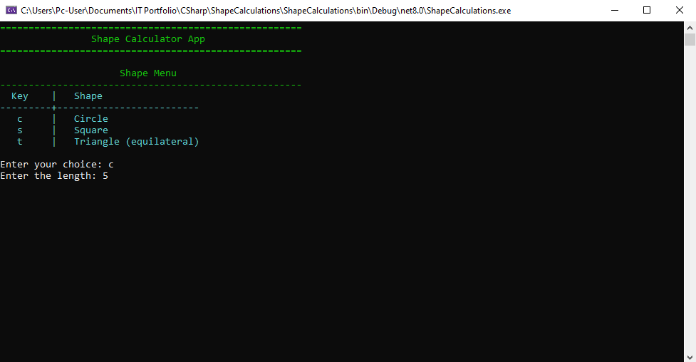

<p align="center">

  <!-- Framework & Language -->
  
  
  

  <!-- Quality -->
  
  

  <!-- CI/CD -->
  

</p>

# Shape Calculations Demo

A cleanly structured **.NET 8 console application** demonstrating:

- Object-oriented shape modelling  
- Dynamic console UI formatting  
- Factory-based creation of shapes  
- Robust input handling  
- A fully isolated, testable architecture

This project implements **Circle**, **Square**, and **Triangle** shape types, each capable of calculating **area** and **boundary length** (and more if extended). All console I/O is abstracted behind `IConsole`, making the entire app unit-testable with no real console dependency.

---

## Features

- Create and calculate areas for:
  - **Circle**
  - **Square**
  - **Triangle**
- Clean separation of concerns:
  - Core application logic
  - Domain models
  - Input parsing
  - Console UI rendering
  - Shape factory pattern
- Extensive test coverage using **xUnit**, including:
  - Domain model tests
  - UI formatting tests
  - Input handler tests
  - Fake console behaviour tests
- Fully deterministic unit tests using a **custom test collection** to disable parallelization only where needed

---

## Screenshots

### Application Startup Screen


### Full Input Workflow


### Final Calculation Result


---

## Getting Started

### Prerequisites

- Windows, Linux, or macOS  
- **.NET 8 SDK**  
- Any IDE (Visual Studio, JetBrains Rider, VS Code)

### Running the Application

1. Clone the repository:
   ```bash
   git clone https://github.com/jnev75/ShapeCalculations.git

2. Navigate into the folder:
   ```bash
   cd ShapeCalculations

3. Run the console app:
   ```bash
   dotnet run --project ShapeCalculations

---

## Project Structure

```text
ShapeCalculations.sln
├── Solution Items/
│   └── README.md                          # Main documentation for GitHub
│
├── ShapeCalculations/                     # Main .NET 8 console application
│   ├── App/
│   │   ├── Core/
│   │   │   └── ShapeCalculatorApp.cs      # High-level orchestration
│   │   │
│   │   ├── Factories/
│   │   │   └── ShapeFactory.cs            # Creates shapes from enums
│   │   │
│   │   ├── Input/
│   │   │   └── ShapeInputHandler.cs       # Parses + validates user input
│   │   │
│   │   ├── Interfaces/
│   │   │   └── IConsole.cs                # Abstraction over Console I/O
│   │   │
│   │   ├── UI/
│   │   │   ├── ConsoleFormatter.cs        # Formatting helpers
│   │   │   └── ConsoleUI.cs               # Console-based UI logic
│   │   │
│   │   └── Utilities/
│   │       ├── ColoredConsole.cs          # High-level ANSI colouring
│   │       ├── ConsoleColorType.cs        # Color enum abstraction
│   │       └── RealConsole.cs             # Real console implementation
│   │
│   ├── Domain/
│   │   ├── Circle.cs
│   │   ├── Shape.cs                       # Abstract base class
│   │   ├── ShapeType.cs                   # Enum for choosing shape types
│   │   ├── Square.cs
│   │   └── Triangle.cs
│   │
│   └── docs/
│       └── screenshots/                   # Assets for README
│
├── ShapeCalculations.UnitTests/           # xUnit test project
│   ├── App/
│   │   ├── Factories/
│   │   │   └── ShapeFactoryTests.cs
│   │   │
│   │   ├── Input/
│   │   │   └── ShapeInputHandlerTests.cs
│   │   │
│   │   ├── UI/
│   │   │   ├── ConsoleFormatterTests.cs
│   │   │   └── ConsoleUITests.cs
│   │   │
│   │   └── Utilities/
│   │       └── ColoredConsoleTests.cs
│   │
│   ├── Domain/
│   │   ├── CircleTests.cs
│   │   ├── ShapeTestHelper.cs             # Shared test helpers
│   │   ├── SquareTests.cs
│   │   └── TriangleTests.cs
│   │
│   ├── Fakes/
│   │   ├── FakeConsole.cs                 # Buffered console for tests
│   │   ├── NullReadConsole.cs             # No-input console variant
│   │   └── ThrowingConsole.cs             # Simulates exceptions
│   │
│   └── DisableParallelization.cs          # xUnit collection definition
│
└── docs/
    └── screenshots/
```

---

## How It Works

| Area                  | Description                                                                   |
| --------------------- | ----------------------------------------------------------------------------- |
| **Shape Creation**    | `ShapeFactory` returns concrete shapes based on `ShapeType`.                  |
| **Input Handling**    | `ShapeInputHandler` sanitises and validates console input.                    |
| **UI Rendering**      | `ConsoleUI` uses a console abstraction for testable output.                   |
| **Color Output**      | `ColoredConsole` maps semantic color types to ANSI escape sequences.          |
| **Domain Models**     | `Circle`, `Square`, and `Triangle` compute area and boundary length using clean OOP inheritance. |
| **App Orchestration** | `ShapeCalculatorApp` ties together input, creation, and display logic.        |

---

## Running Tests

To run all tests:

```bash
dotnet test ShapeCalculations.UnitTests
```

Specific test category:

```bash
dotnet test --filter "Category=UI"
```

Or run only failed tests (rerun):

```bash
dotnet test --rerun-failed
```

---

## License

This project is licensed under the MIT License.

---

## Acknowledgements

xUnit — lightweight, flexible testing framework

.NET 8 — fast and modern console runtime

Built with ❤️ using C# .NET Console App by [James Neville](https://github.com/jnev75)